<div align="center">

# 📋 Task Management System

A full-stack application designed to help teams and individuals organize projects, track tasks, and collaborate effectively using a modern, scalable architecture.

[](https://www.java.com)
[](https://spring.io/projects/spring-boot)
[](https://react.dev)
[](https://www.postgresql.org)
[](https://www.docker.com)

<br />

### **[🚀 View Live Demo](https://taskmanager.blubug.me/)**

**Demo Admin Credentials:**
- **Email:** `admin@example.com`
- **Password:** `AdminPass123!`
> *You can also create your own user account to test the platform.*

**Deployment Details:**
- Deployed using **Dokploy** on a **DigitalOcean** VPS.
- DNS managed by **Cloudflare**.

</div>

Both the frontend and backend of this project follow the same principles of modularity, scalability, and clean architecture, ensuring a reliable and maintainable codebase.

## Contents

- [Features](#features)
- [Tech Stack](#tech-stack)
- [Architecture Overview](#architecture-overview)
- [Folder Structures](#folder-structures)
- [API Overview](#api-overview-short)
- [Screenshots](#screenshots)

## Features

- **Full-Stack Task Management**: End-to-end solution for managing projects and tasks.
- **Role-Based Access Control**: Different permissions for Admins, Project Owners, and Members.
- **Interactive UI**: Dynamic dashboards and responsive frontend components.
- **Secure Authentication**: JWT-based secure login and session management.
- **Containerized**: Fully Docker-ready for both frontend and backend.

## Tech Stack

### Backend

- **Java 25+** & **Spring Boot 3.x**
- **Spring Security** (JWT Authentication)
- **PostgreSQL**

### Frontend

- **React 18** & **Vite**
- **React Router** for routing
- **Redux** for state management
- **Axios** for API requests

## Architecture Overview

This repository contains two main components:

- **[Backend (Spring Boot)](./Task_Management_SpringBoot/)**: A robust REST API responsible for managing authentication, users, projects, and tasks. It enforces role-based access control and provides structured data to the client.
- **[Frontend (ReactJS)](./task_management_reactjs/)**: A dynamic and responsive single-page application built with React and Vite. It consumes the backend APIs to deliver a seamless user experience.

Both applications can be run locally for development or containerized using Docker for production deployment. Please refer to their respective `README.md` files for detailed setup instructions and environment variable configurations.

## Folder Structures

### Backend (Spring Boot)

```text
src/
├── main/             # Contains all application source code
│   ├── java/org/devofblue/task_management_springboot/
│   │   ├── config/       # Security, CORS, and application configurations
│   │   ├── controller/   # REST API endpoints handling HTTP requests
│   │   ├── dto/          # Data Transfer Objects (request/response models)
│   │   ├── entity/       # Database Entities (JPA Models)
│   │   ├── enums/        # Enumerations for roles, statuses, etc.
│   │   ├── exception/    # Custom exceptions and global error handling
│   │   ├── repository/   # Database access interfaces (Spring Data JPA)
│   │   ├── security/     # JWT filters, providers, and authentication logic
│   │   └── service/      # Business logic interfaces and implementations (impl)
│   └── resources/    # Application configurations (application.yaml)
└── test/             # Unit and integration tests
```

### Frontend (ReactJS)

```text
src/                  # Main source code folder
├── app/              # Global app setup (e.g., Redux store configuration)
├── components/       # Shared UI components (common, layout)
├── features/         # Feature-based modules (auth, dashboard, projects, tasks, etc.)
│   └── [feature]/    # Inside each feature:
│       ├── api/      # Feature-specific API calls
│       ├── components/# Feature-specific UI components
│       ├── hooks/    # Feature-specific custom hooks
│       ├── pages/    # Feature-specific page views
│       ├── redux/    # Feature-specific state management
│       └── utils/    # Feature-specific helpers
├── hooks/            # Global custom React hooks
├── lib/              # Third-party library configs (e.g., Axios instance)
├── routes/           # Application routing definitions
├── styles/           # Global CSS/Tailwind styles
└── utils/            # Global helper functions and utilities
```

## API Overview (Short)

The backend exposes a structured RESTful API under the base path `/api`. Below is a brief overview of the available modules:

- **Auth** (`/api/auth`): Handles user registration, login, and JWT token management (refresh/logout).
- **Users** (`/api/users`): Profile management, user listing, and role updates (Admin functionalities).
- **Projects** (`/api/projects`): CRUD operations for projects, including managing project members.
- **Tasks** (`/api/projects/{projectId}/tasks`): CRUD operations for tasks within a project, status updates, and task comments.
- **Join Requests** (`/api/projects/{projectId}/join-requests`): Allows users to request to join existing projects and admins to approve/reject them.
- **Dashboard** (`/api/dashboard`): Retrieves aggregated statistics and personalized overview data for users and admins.

For more detailed information about specific endpoint payloads, queries, and required roles, please check the [Backend README](./Task_Management_SpringBoot/README.md).

## Screenshots

### Authentication

<div align="center">
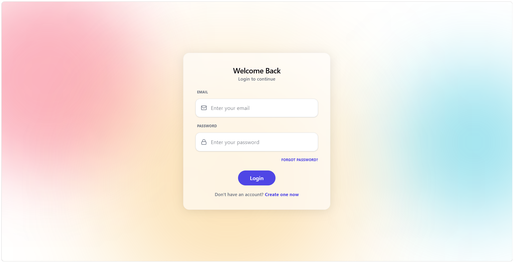
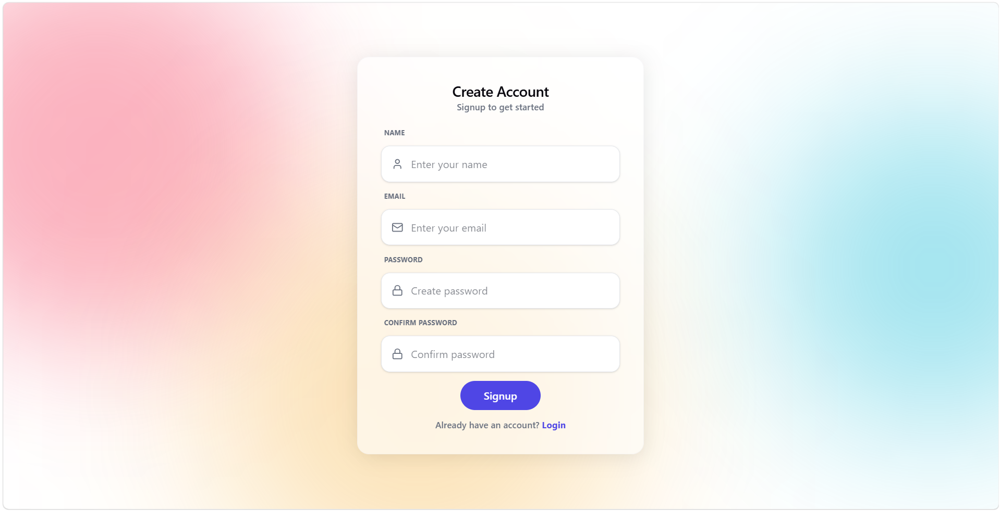
</div>

### Dashboard

<div align="center">
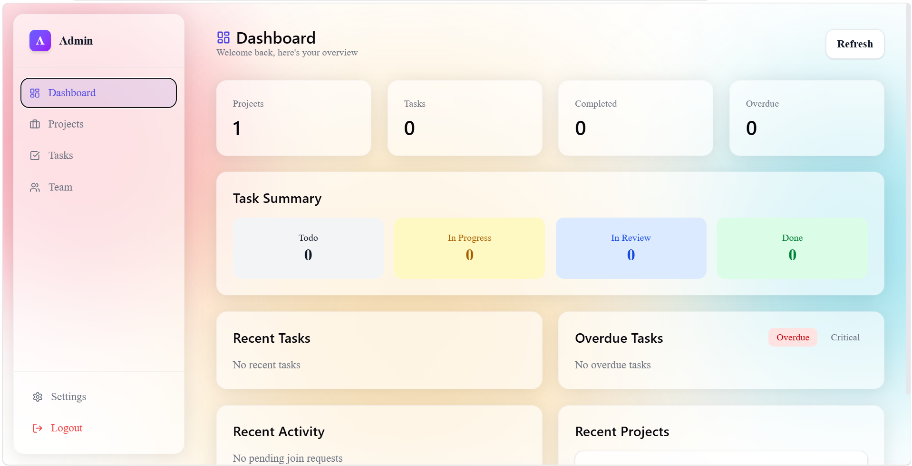
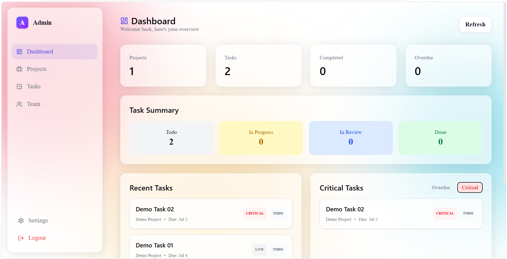
</div>

### Projects

<div align="center">
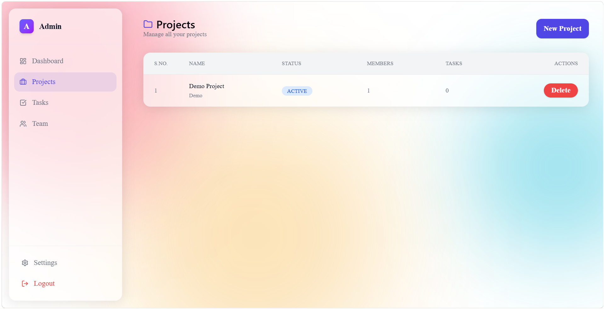
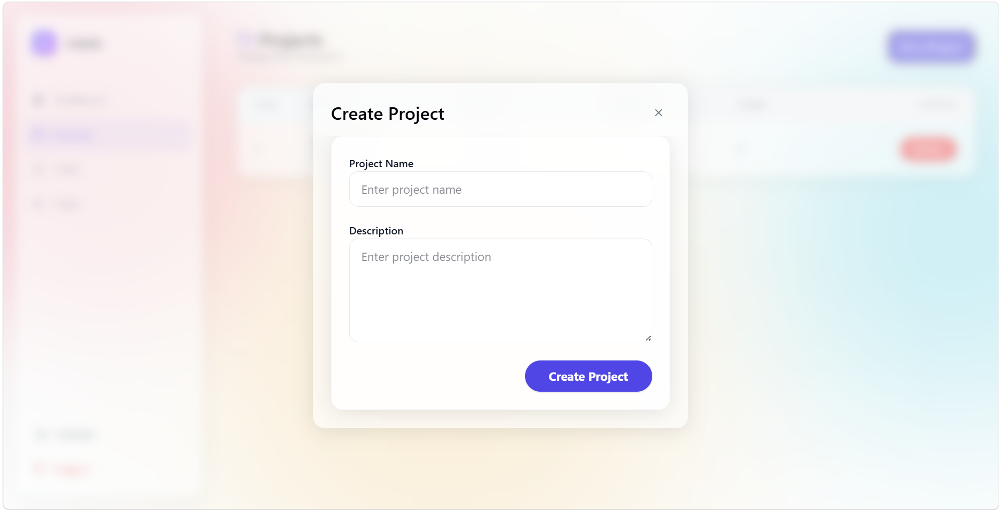
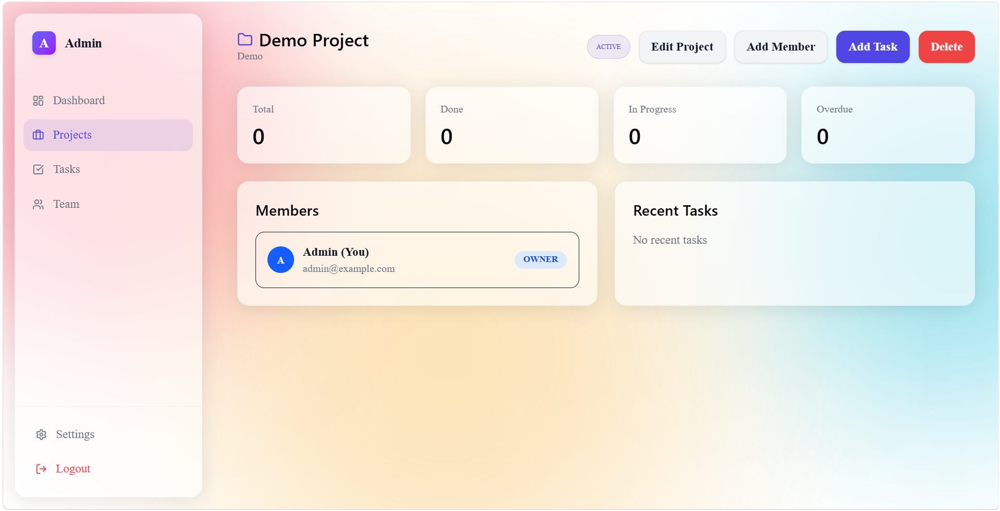
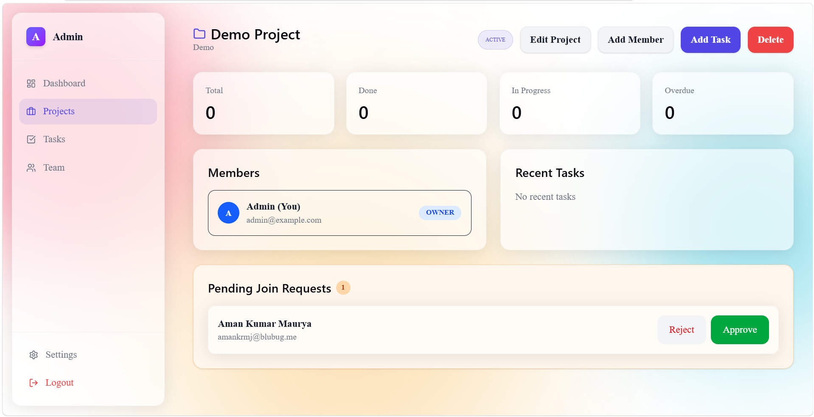
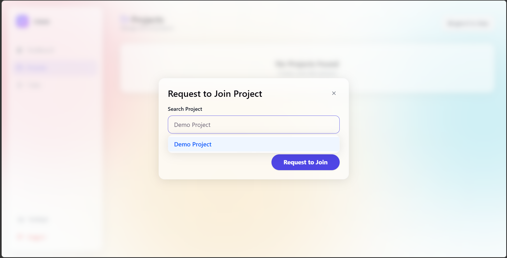
</div>

### Tasks

<div align="center">
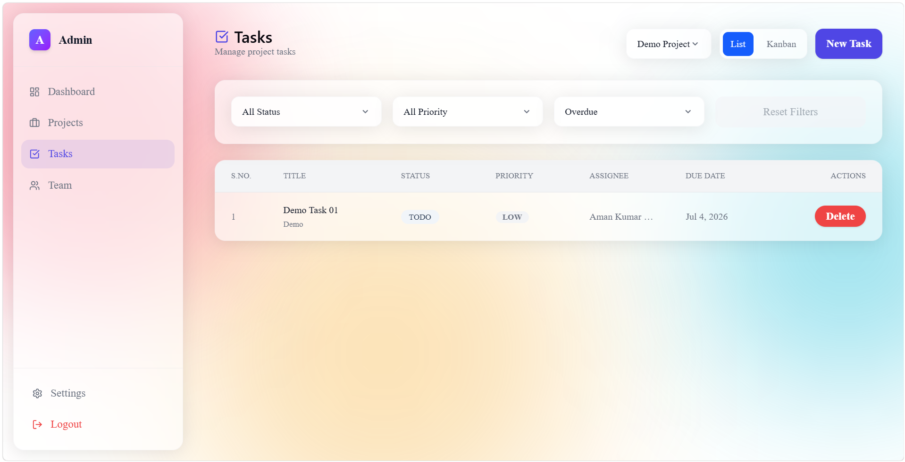
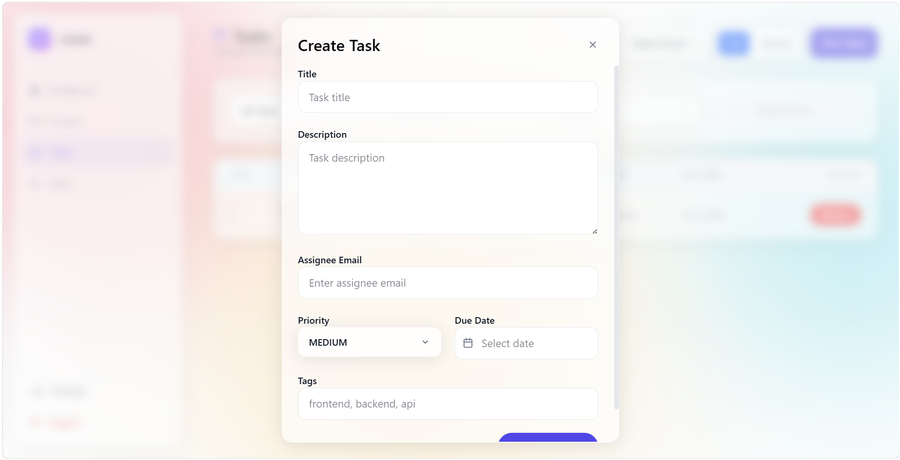
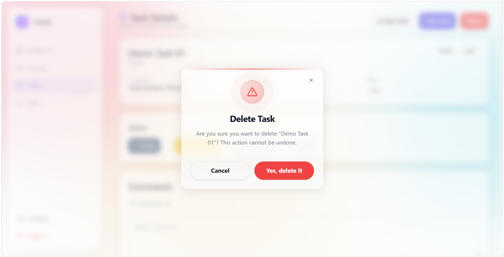
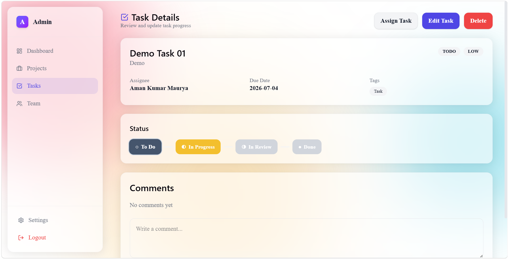
</div>

### Team

<div align="center">
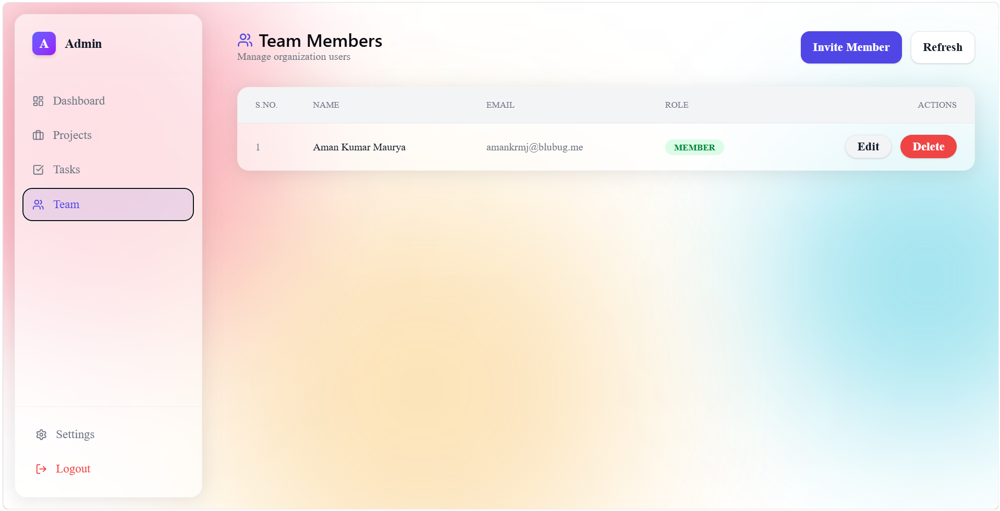
</div>

### Settings

<div align="center">
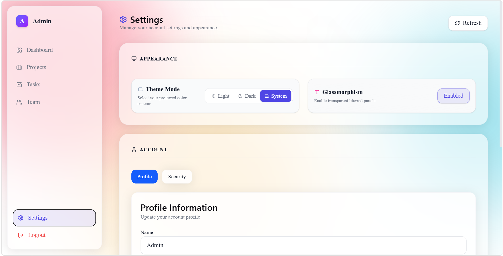
</div>
